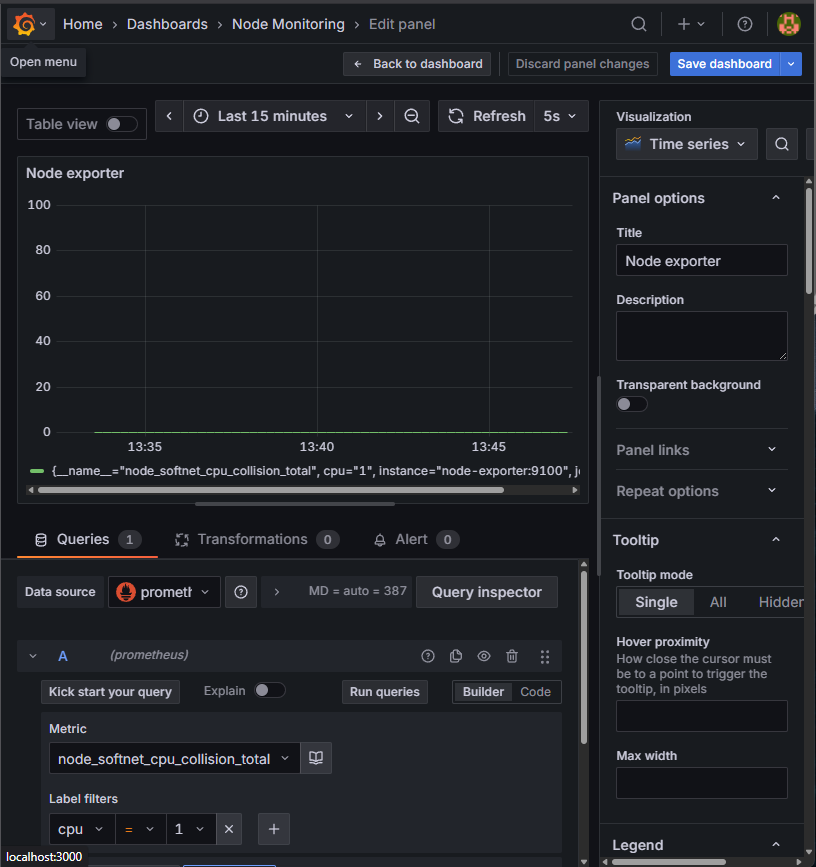
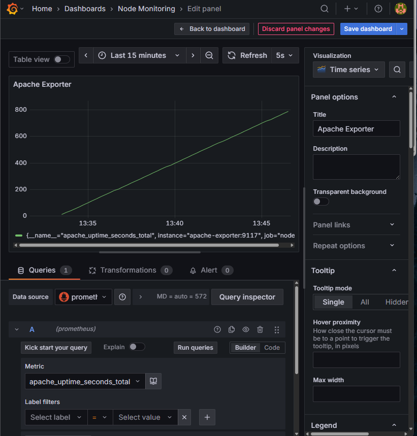

# Activity: Docker


1. `prometheus.yml` Configuration File

```yml
global:
  scrape_interval: 15s

scrape_configs:
  - job_name: node
    static_configs:
      - targets: ['node-exporter:9100','apache-exporter:9117', 'apache:80']
```

2. Docker Commands to Build the following containers

2.1 Creating network called `mynet`

```makefile
network:
    @echo "Creating Docker network..."
    -docker network create mynet || true
```

2.2 Creating Persistent Storage (Volume) for Grafana with Grafana container

```makefile
init-grafana:
	@echo "Starting Grafana task..."
	@echo "Creating Grafana volume"
	-docker volume create grafana-vol
	@echo "Running Grafana container"
	-docker stop grafana || true
	-docker run --rm -d -p 3000:3000 --network mynet -v grafana-vol:/var/lib/grafana --name grafana grafana/grafana
```

2.3 All `docker run` commands for each container; The collection of commands consist of 
- Node Exporter container
- Prometheus container
- Grafana container
- Apache container + Apache Exporter container

```makefile
init-node-exporter:
	@echo "Starting Node Exporter task..."
	@echo "Stop existing Node Exporter container"
	-docker stop node-exporter || true
	@echo "Run Node Exporter container"
	-docker run --rm -d --name node-exporter -p 9100:9100 --network mynet prom/node-exporter

init-prometheus:
	@echo "Starting Prometheus task..."
	@echo "Stop existing Prometheus container"
	-docker stop prometheus || true
	@echo "Run Prometheus container"
	-docker run --rm -d --name prometheus -p 9090:9090 --network mynet -v ./prometheus.yml:/etc/prometheus/prometheus.yml prom/prometheus

init-grafana:
	@echo "Starting Grafana task..."
	@echo "Creating Grafana volume"
	-docker volume create grafana-vol
	@echo "Running Grafana container"
	-docker stop grafana || true
	-docker run --rm -d -p 3000:3000 --network mynet -v grafana-vol:/var/lib/grafana --name grafana grafana/grafana

init-apache:
	@echo "Starting Apache Web Server task..."
	-docker stop apache || true
	-docker stop apache-exporter || true
	@echo "Running Apache Web Server container"
	-docker run -d --rm --name apache --network mynet -p 8080:80 -v ./status.conf:/etc/apache2/mods-enabled/status.conf ubuntu/apache2
	@echo "Starting Apache Exporter task..."
	@echo "Running Apache Exporter container"
	-docker run -d --rm --name apache-exporter --network mynet -p 9117:9117 bitnami/apache-exporter --scrape_uri="http://apache:80/server-status?auto"
```

### Node Exporter Sample Metrics

Number of collision occur while obtaining device lock while transmitting @ cpu=1




### Apache Exporter Sample Metrics

Current uptime in seconds

